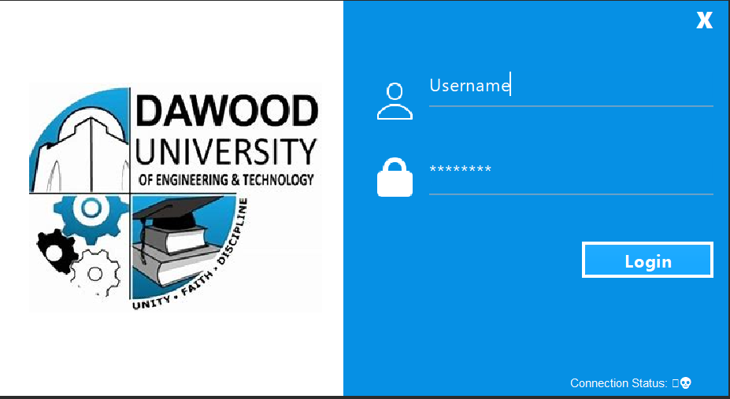
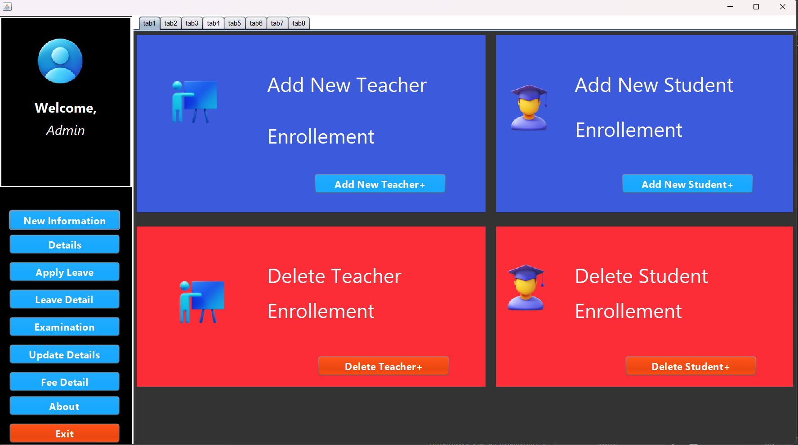
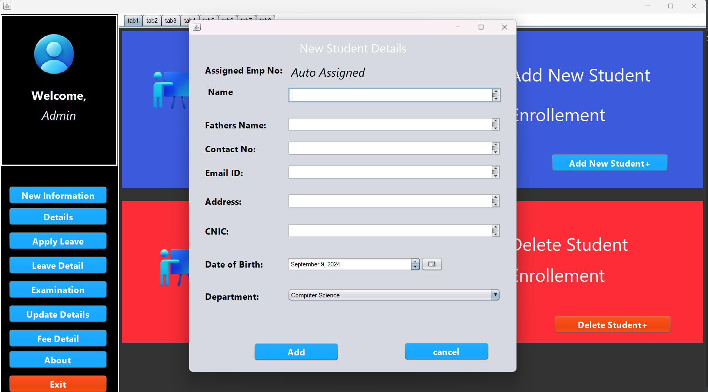
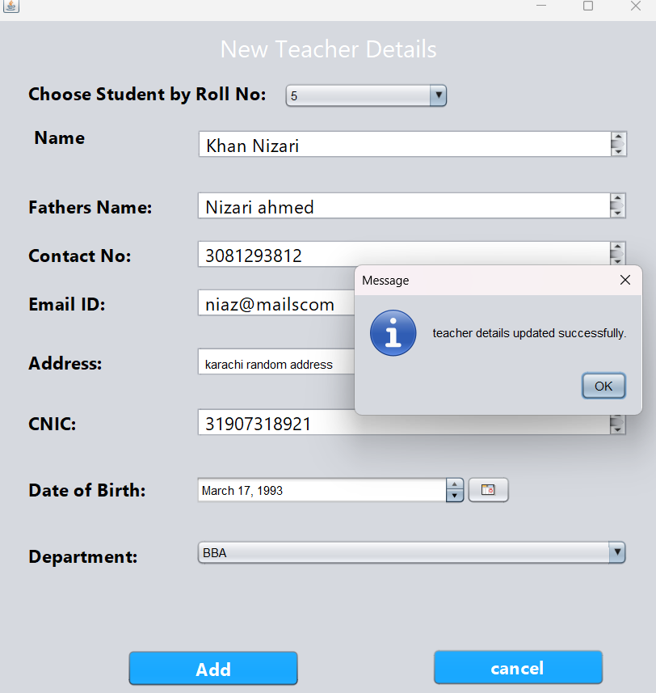
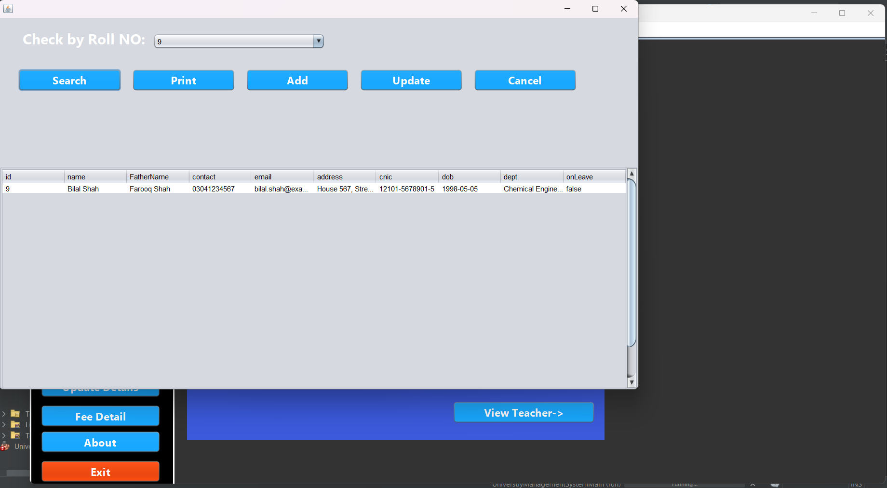
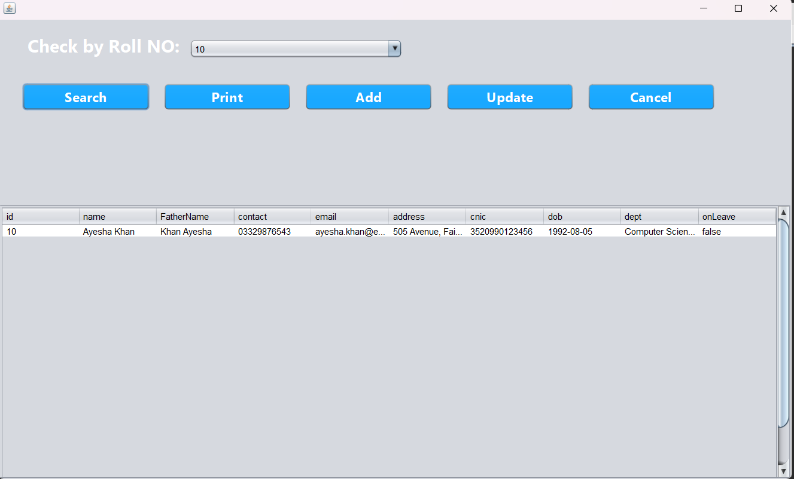
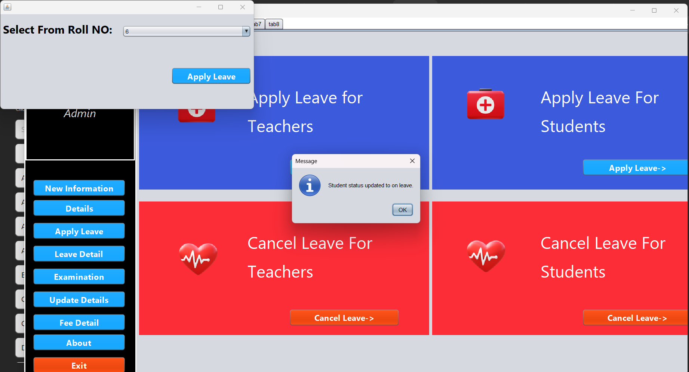
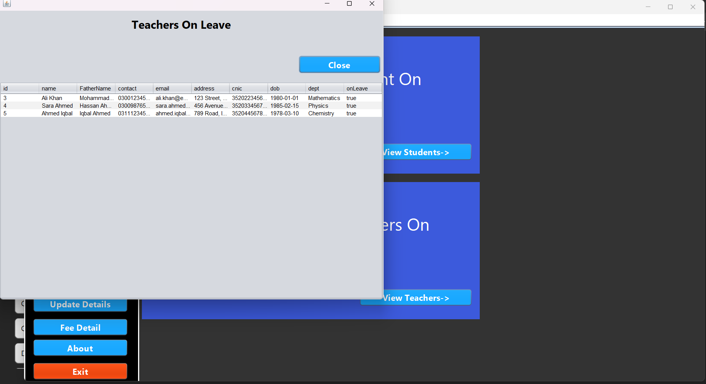
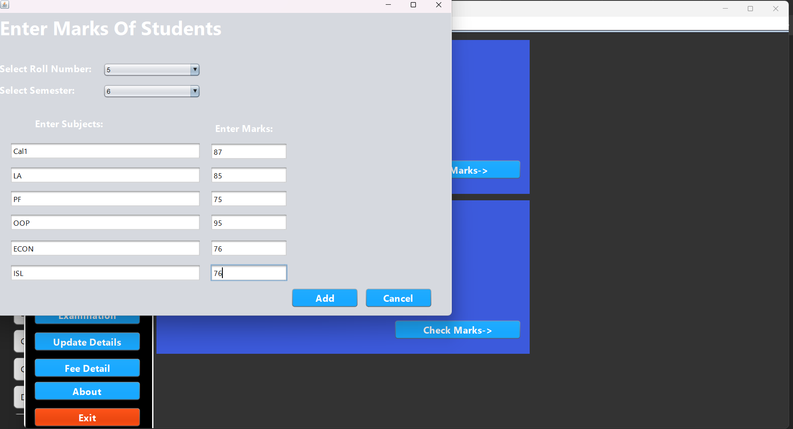
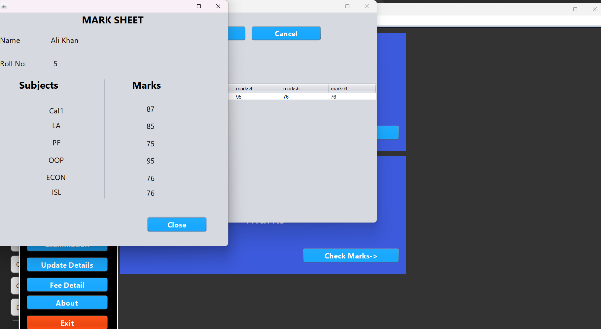

# University Management System with MySql Database

Made a Univestiy management system, with Java, swing, and myqsl database.

This project applies Object-Oriented Programming (OOP) principles, utilizing classes and objects to represent key entities such as students, courses, and faculty. The system is designed to efficiently handle tasks like student registration, course enrollment, and grade management, demonstrating the use of encapsulation, inheritance, and polymorphism. The entire development process is well-documented in the repository, showcasing the project’s evolution and my proficiency in using OOP to solve real-world problems.

The primary goal of undertaking a summer project in Java Object-Oriented
Programming (OOP) is to enhance proficiency in Java programming with a
specific focus on Object-Oriented principles. This includes gaining a deep
understanding of concepts such as classes, objects, inheritance, polymorphism,
encapsulation, and abstraction. Moreover, the objective is to bridge the gap
between theoretical knowledge and practical application, enabling participants to
develop solutions that align with industry best practices. In the last beyond
honing technical skills, this project in Java OOP also aims to develop
participants&#39; project management and collaboration abilities

# Objective
1. Skill Development in Java OOP Programming
2. Practical Application of Java OOP Concepts
3. Project Management and Collaboration

## Languages/Liabraries Used

**GUI:** Java-Swing

**Database:** MySQL

## Features

1. Login Functonalty (Admin Only)

2. Admin Panel

3. Adding, Deleting or Updating the Student

4. Adding, Deleting, or Updating the Teachers

5. Show Details of Students

6. Show Details of Teachers

7. Apply Leave for Students or Teachers

8. View Teachers/Students on Leave 

9. Add Student Marks

10. Check Student Result 

## Contribution
Muhammad Ilyas Khan(23-cs-115)

Anas Zaidi(23-cs-137)

